# Map Generator Language (.mg) Documentation

## Positions (x,y)

Positions are in the format `(x, y)`, where x and y are any two expressions that evaluate to integers. Their main purpose is to specify positions for [CREATE statements](#create-statements).

#### Position Usage Example:

This code:

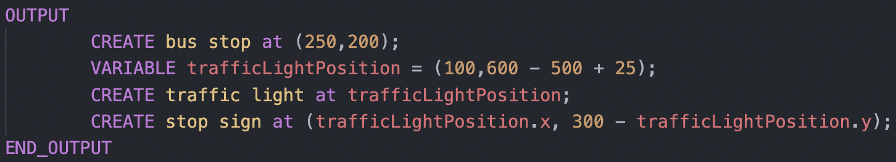

Creates the following map:

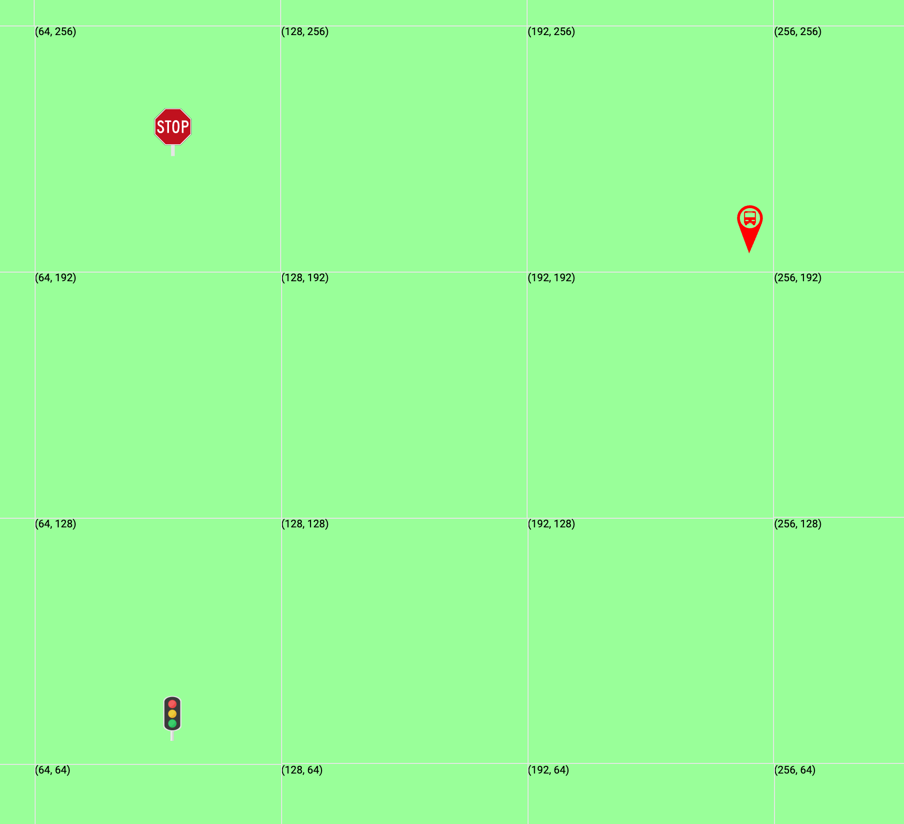

## CREATE Statements

Create statements are what actually puts things (markers, streets, buildings, etc.) onto the map. They can be used in [Function Declarations](#functions) or the [OUTPUT block](#output-block).

### Creating Markers

Creating markers can be done by specifying a marker type and a [Position](#positions-xy): `CREATE [bus stop, traffic light, stop sign, or train stop] at (x,y);`

#### CREATE Marker Usage Example:

This code:

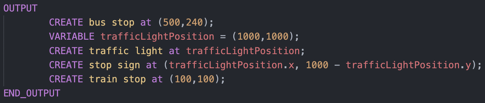

Creates the following map:


### Creating Streets, Highways, and Bridges

Creating streets can be done by specifying a street type, a start [Position](#positions-xy), and an end [Position](#positions-xy): `CREATE [street, highway, or bridge] from (x1,y1) to (x2,y2);`

#### CREATE Line Usage Examples:

This code:

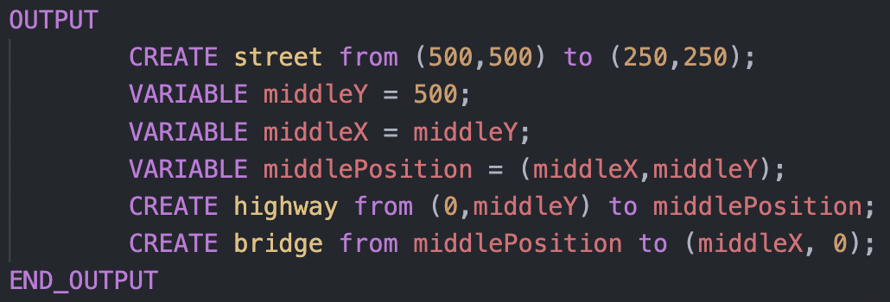

Creates the following map:

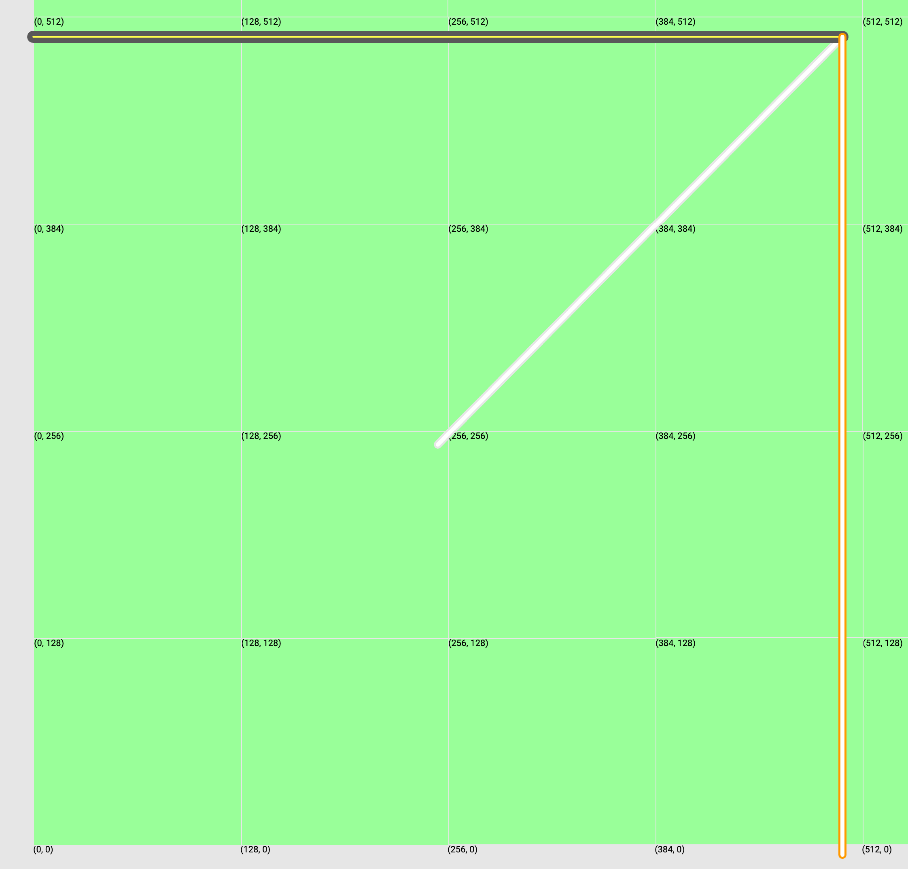

### Creating Buildings and Water

Creating buildings or water can be done by specifying a type and four coordinate [Positions](#positions-xy). The positions must be stated in rectangular order.

For example, this would start with the top left, go to top right, go to bottom right, then finish with bottom left:

`CREATE [water or building] at NorthWestPosition NorthEastPosition SouthEastPosition SouthWestPosition;`

Another example, this would start with the bottom left, go to bottom right, go to top right, then finish with top left:

`CREATE [water or building] at SouthWestPosition SouthEastPosition NorthEastPosition NorthWestPosition;`

#### CREATE Polygon Usage Example:

Note: Code is unnecessarily verbose so that you can understand the documentation better

This code:

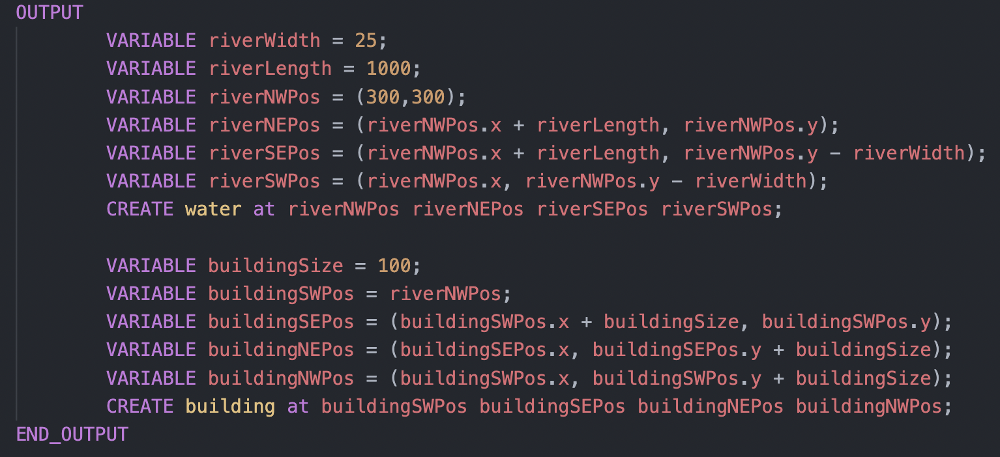

Creates the following map:


## Expressions

In this documentation, we will refer to expressions as anything that evaluates to a primitive value. For example, an expression could be a simple number (4 or 1212), a simple boolean (true or false), a [Position](#positions-xy), or any other computation that can be evaluated.

#### Expression Examples:

```
  // Boolean expression examples
  true
  12 > 5 AND 1 < 10 OR 1 < 2
  myBooleanVariable // where myBooleanVariable holds an expression that evaluates to a boolean

  // Number expressions examples
  10
  12 + 2
  myNumberVariable // where myNumberVariable holds an expression that evaluates to a number

  // Position expression examples
  (10,10);
  myPositionVariable // where myPositionVariable holds an expression that evaluates to a position
  (myNumberVariable1, myNumberVariable2) // where myNumberVariables evaluate to numbers
```

## Variables and Constants

Variables and constants are a way to store values that you want to refer to in many locations. Variables can be assigned to any [Expression](#expressions).

### Variable Declarations

You can declare a variable inside [Functions](#functions), or inside the [OUTPUT block](#output-block), and they can be used only after they have been declared. They can be reassigned any time after they are declared.

They can be declared by : `VARIABLE myVariableName = v` where `v` can be any expression.

#### VARIABLE Declaration Example:

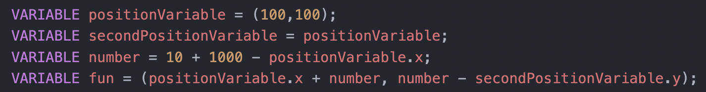

### Reassigning Variables

Variables can be reassigned at any point after they have been declared, to any expression, of any type.

#### Variable Reassignment Example:

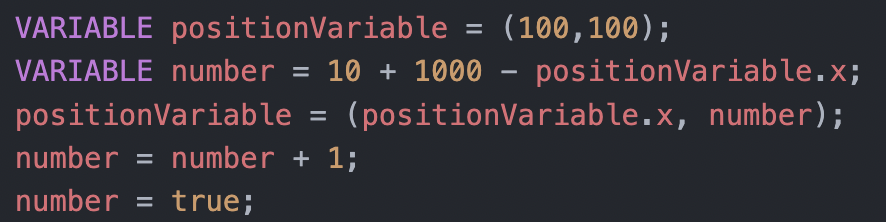

### Constant Declarations

You can declare a constant only inside the [DEFINITIONS block](#definitions-block), and they can be used anywhere in your program. They can not be reassigned.

They can be declared by : `CONSTANT myConstantName = v` where `v` can be any expression.

#### CONSTANT Declaration Example:

This code:

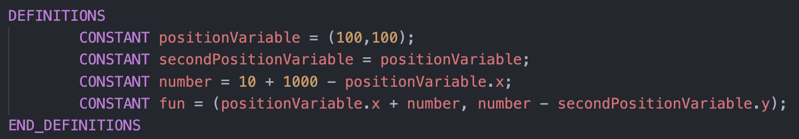

### Accessing X and Y Coordinates From Variables/Constants

[Constants and Variables](#variables-and-constants) can hold positions. Sometimes it can be useful to access the x or y position of the coordinate. You can do this simply by append .y or .x to the variable you want to access the coordinate from.

#### Coordinate Access Example:

This code:

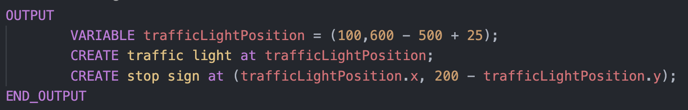

Creates the following map:


## Functions

### Function Declarations

You can declare a function only inside the [DEFINITIONS block](#definitions-block). Declaring and using functions allow for, most commonly, the quick creation of certain map patterns throughout different locations in the map. Functions do not return a value; instead, they are simply another way of creating things on the map with [CREATE statements](#create-statements). Functions can take in any number of inputs (ie. parameters/arguments), each separated by a comma. Functions can then declare [variables](#variable-declarations), reassign variables, use [loops](#loops), call other functions, and create anything with [CREATE statements](#create-statements).

#### FUNCTION Declaration Example:

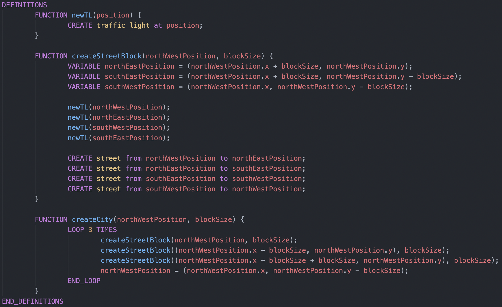

### Function Calls

Function calls can be made either within other functions, or within the [OUTPUT block](#output-block).

#### Function Call Example:

This code (with the function declarations above):

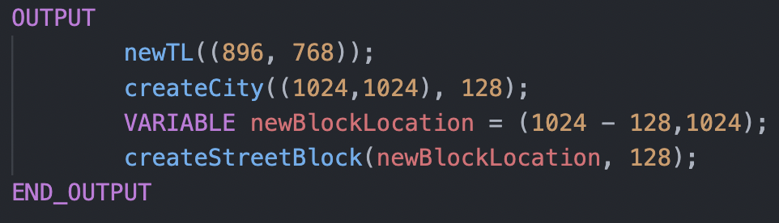

Creates the following map:

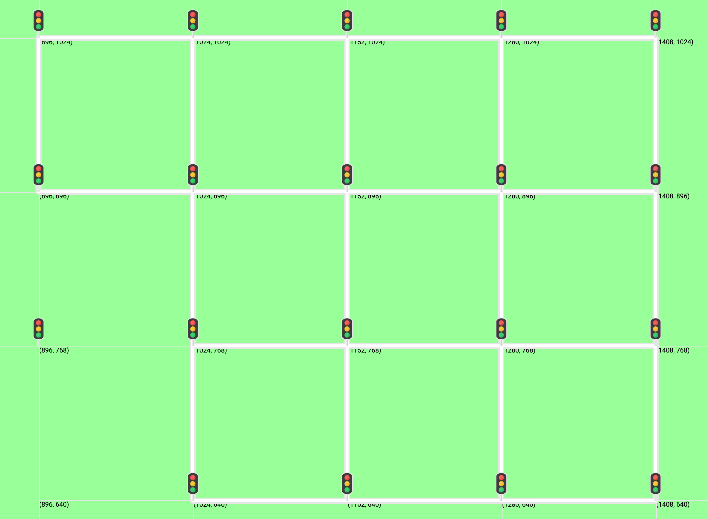

## Control Flow

### Loops

You can use loops inside [FUNCTION declarations](#functions), or in the [OUTPUT block](#output-block). Loops can be used to execute any number of statements any number of times. You must specify the number of times to loop through any expression that evaluates to a number.

#### LOOP Example 1:

This code:

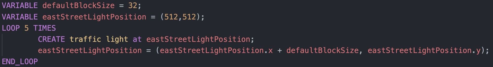

Creates the following map:


#### LOOP Example 2:

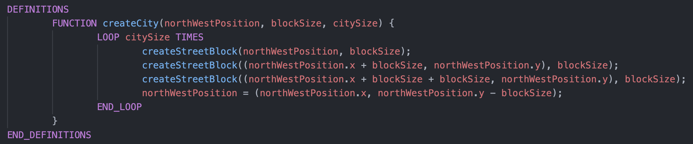

### IF / ELSE_IF / ELSE

You can use loops inside [FUNCTION declarations](#functions), or in the [OUTPUT block](#output-block). You can use IF blocks to conditionally preform operations in your program. IF blocks can contain ELSE_IF, as well as ELSE blocks. IF blocks can also be nested.

#### IF / ELSE_IF / ELSE example usage 1:

```
IF 1 > 2 THEN
        // do something
ELSE
        // do something else
END_IF

IF myBooleanVariable THEN
        // do something
ELSE_IF myFirstNumberVariable > mySecondNumberVariable THEN
        // do something else if
END_IF
```

#### IF / ELSE_IF / ELSE example usage 2:

```
DEFINITIONS
        FUNCTION createSquare(squareType, squareSize, nwPos) {
                VARIABLE nePos = (nwPos.x + squareSize, nwPos.y);
                VARIABLE sePos = (nwPos.x + squareSize, nwPos.y - squareSize);
                VARIABLE swPos = (nwPos.x, nwPos.y - squareSize);

                IF squareType == 1 THEN // squareType 1 means water
                        CREATE water at nwPos nePos sePos swPos;
                ELSE_IF squareType == 2 THEN // squareType 2 means water
                        CREATE building at nwPos nePos sePos swPos;
                END_IF
        }

        FUNCTION createStreetBlock(northWestPosition, blockSize, addStopLights) {


                IF blockSize <= blockSizeLimit THEN
                        // do nothing, the block size is good!
                ELSE_IF (blockSize / 2 < blockSizeLimit) THEN
                        // try to cut the block size in half first
                        blockSize = blockSize / 2;
                ELSE
                        // if cutting in half doesnt work, then just use the blockSizeLimit
                        blockSize = blockSizeLimit;
                END_IF

                VARIABLE northEastPosition = (northWestPosition.x + blockSize, northWestPosition.y);
                VARIABLE southEastPosition = (northWestPosition.x + blockSize, northWestPosition.y - blockSize);
                VARIABLE southWestPosition = (northWestPosition.x, northWestPosition.y - blockSize);

                IF addStopLights AND addMarkers THEN
                        newTL(northWestPosition);
                        newTL(northEastPosition);
                        newTL(southWestPosition);
                        newTL(southEastPosition);
                END_IF

                CREATE street from northWestPosition to northEastPosition;
                CREATE street from northEastPosition to southEastPosition;
                CREATE street from southEastPosition to southWestPosition;
                CREATE street from southWestPosition to northWestPosition;
        }

        FUNCTION createCity(northWestPosition, blockSize, addStopLights) {
                LOOP 3 TIMES
                        createStreetBlock(northWestPosition, blockSize, addStopLights);
                        createStreetBlock((northWestPosition.x + blockSize, northWestPosition.y), blockSize, addStopLights);
                        createStreetBlock((northWestPosition.x + blockSize + blockSize, northWestPosition.y), blockSize, addStopLights);
                        northWestPosition = (northWestPosition.x, northWestPosition.y - blockSize);
                END_LOOP

        }

        FUNCTION newTL(position) {
                CREATE traffic light at position;
        }

        CONSTANT addMarkers = true;
        CONSTANT blockSizeLimit = 1000;
END_DEFINITIONS

OUTPUT
        createSquare(1, 500, (1000,1000));
        createSquare(2, 100, (1610,985));
        createCity((1600,1000), 128, true);
END_OUTPUT
```

Creates the following map:


## Program Structure

### OUTPUT Block

These are required. Output blocks contain all of the statements that are meant specifically to build the map. The output block can contain variable declarations, variable reassignments, function calls, and loops.

#### OUTPUT Block Example:

```
OUTPUT
        CREATE street from (500,500) to (250,250);
        VARIABLE middleY = 500;
        VARIABLE middleX = middleY;
        VARIABLE middlePosition = (middleX,middleY);
        CREATE highway from (0,middleY) to middlePosition;
        CREATE bridge from middlePosition to (middleX, 0);
END_OUTPUT
```

Creates the following map:


### DEFINITIONS Block

These are optional. If you define a DEFINITIONS block, it must be above the OUTPUT block. Definition blocks contain all of the constant and function declarations.

#### DEFINITIONS Block Example:

```
DEFINITIONS
        FUNCTION newTL(position) {
                CREATE traffic light at position;
        }

        FUNCTION createStreetBlock(northWestPosition, blockSize) {
                VARIABLE northEastPosition = (northWestPosition.x + blockSize, northWestPosition.y);
                VARIABLE southEastPosition = (northWestPosition.x + blockSize, northWestPosition.y - blockSize);
                VARIABLE southWestPosition = (northWestPosition.x, northWestPosition.y - blockSize);

                newTL(northWestPosition);
                newTL(northEastPosition);
                newTL(southWestPosition);
                newTL(southEastPosition);

                CREATE street from northWestPosition to northEastPosition;
                CREATE street from northEastPosition to southEastPosition;
                CREATE street from southEastPosition to southWestPosition;
                CREATE street from southWestPosition to northWestPosition;
        }

        FUNCTION createCity(northWestPosition, blockSize) {
                LOOP 3 TIMES
                        createStreetBlock(northWestPosition, blockSize);
                        createStreetBlock((northWestPosition.x + blockSize, northWestPosition.y), blockSize);
                        createStreetBlock((northWestPosition.x + blockSize + blockSize, northWestPosition.y), blockSize);
                        northWestPosition = (northWestPosition.x, northWestPosition.y - blockSize);
                END_LOOP
        }

        CONSTANT centerPosition = (512,512);
        CONSTANT defaultBlockSize = 256;
END_DEFINITIONS
```

### DEFINITIONS Block

These are optional. If you define a DEFINITIONS block, it must be above the OUTPUT block. Definition blocks contain all of the constant and function declarations.

## Other Features / Things to Know

### Defining a Canvas Size

You can define the canvas size of your map by including `CANVAS_SIZE = width by height;` at the top of your file, where width and hieght are both positive numbers. If you do not define a canvas size, the default is 8192 by 4096 - meaning that your x coordinate can go up to 8192, and your y coordinate can go up to 4096.

#### Canvas Size Example:

```
CANVAS_SIZE = 1000 by 1000;
```

### Comments

You can put a line comment anywhere in your program using the syntax: `// this is a line comment`.

#### Comment Example:

```
VARIABLE cityCentreLocation = (100,100); // stores the location of the city centre
```

### Calling Functions Within Functions and Recursion

You have full power to call functions within other functions, or do any type of recursion if necessary. An error will appear if you accidentally have infinite recursion in your code.

#### Recursion vs Loop Example:

```
DEFINITIONS
        FUNCTION createNHorizontalTrafficLightsRecursive(numberOfLights, position, gapSize) {
                IF(numberOfLights > 0) THEN
                        CREATE traffic light at position;
                        createNHorizontalTrafficLightsRecursive(numberOfLights - 1, (position.x + gapSize, position.y), gapSize);
                END_IF
        }

        FUNCTION createNHorizontalTrafficLightsWithLoop(numberOfLights, position, gapSize) {
                LOOP numberOfLights TIMES
                        CREATE traffic light at position;
                        position = (position.x + gapSize, position.y);
                END_LOOP
        }
END_DEFINITIONS

OUTPUT
        createNHorizontalTrafficLightsRecursive(10, (2000,2000), 100);
        createNHorizontalTrafficLightsWithLoop(10, (2000,2200), 100);
END_OUTPUT
```

Creates the following map:
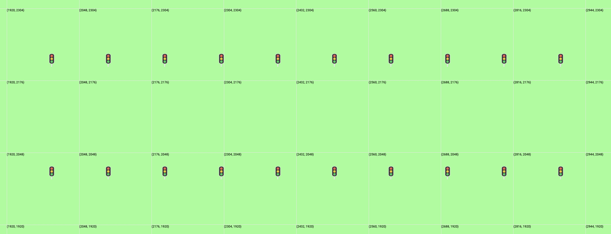

## Entire Program

To sum things up: here is a list of everything that is allowed in each section of the program.

- DEFINITIONS block (optional)
  - FUNCTION declarations
    - Variable Declarations
    - Loops
    - Create statements
    - Variable reassignments
  - CONSTANT declarations
- OUTPUT block
  - Function calls
  - Create statements
  - Loops
  - Variable declarations
  - Variable reassignments

#### Program example:

```
DEFINITIONS
        FUNCTION createStreetBlock(northWestPosition, blockSize) {
                VARIABLE northEastPosition = (northWestPosition.x + blockSize, northWestPosition.y);
                VARIABLE southEastPosition = (northWestPosition.x + blockSize, northWestPosition.y - blockSize);
                VARIABLE southWestPosition = (northWestPosition.x, northWestPosition.y - blockSize);

                CREATE traffic light at northWestPosition;
                CREATE traffic light at northEastPosition;
                CREATE traffic light at southWestPosition;
                CREATE traffic light at southEastPosition;

                CREATE street from northWestPosition to northEastPosition;
                CREATE street from northEastPosition to southEastPosition;
                CREATE street from southEastPosition to southWestPosition;
                CREATE street from southWestPosition to northWestPosition;
        }

        FUNCTION createTrafficLight(position) {
                CREATE traffic light at position;
        }

        FUNCTION createCity(northWestPosition, blockSize) {
                LOOP 3 TIMES
                        createStreetBlock(northWestPosition, blockSize);
                        createStreetBlock((northWestPosition.x + blockSize, northWestPosition.y), blockSize);
                        createStreetBlock((northWestPosition.x + blockSize + blockSize, northWestPosition.y), blockSize);
                        northWestPosition = (northWestPosition.x, northWestPosition.y - blockSize);
                END_LOOP
        }

        CONSTANT centerPosition = (512,512);
        CONSTANT defaultBlockSize = 256;
END_DEFINITIONS

OUTPUT
        createStreetBlock(centerPosition, defaultBlockSize);
        createStreetBlock((centerPosition.x + defaultBlockSize, centerPosition.y), defaultBlockSize);

        createCity((1024,1024), 124);
        CREATE highway from (0,centerPosition.y) to centerPosition;
        CREATE bridge from (0,0) to centerPosition;

        createTrafficLight(centerPosition);
        CREATE stop sign at (512, 256);
        CREATE bus stop at (768, 384);
        CREATE train stop at (1024, 384);

        VARIABLE loops= 10;

        VARIABLE eastStreetLightPosition = (centerPosition.x, centerPosition.y);

        LOOP 10 TIMES
            createTrafficLight(eastStreetLightPosition);
            eastStreetLightPosition = (eastStreetLightPosition.x + defaultBlockSize, eastStreetLightPosition.y);
        END_LOOP

        CREATE street from (0,0) to (256,100);
        VARIABLE middleY = 1024;
        VARIABLE middleX = middleY;
        VARIABLE middlePosition = (middleX,middleY);
        CREATE highway from (0,middleY) to middlePosition;
        CREATE bridge from middlePosition to (2048, 0);
        CREATE bus stop at (500,240);
        VARIABLE trafficLightPosition = (1000,1000);
        CREATE traffic light at trafficLightPosition;
        CREATE stop sign at (trafficLightPosition.x, 1000 - trafficLightPosition.y);
        CREATE train stop at (100,100);
        VARIABLE positionVariable = (100,100);
        VARIABLE secondPositionVariable = positionVariable;
        VARIABLE number = 10 + 1000 - positionVariable.x;
        VARIABLE fun = (positionVariable.x + number, number - secondPositionVariable.y);
END_OUTPUT

```

## powers of 2 for canvas

## errors will still render
