# Map Generator Language (.mg) Documentation

---

## Table of contents

1. [Positions](#positions-xy)
2. [CREATE Statements](#create-statements)
   - [Markers](#creating-markers)
   - [Streets/Highways/Bridges](#creating-streets-highways-and-bridges)
   - [Water/Buildings](#creating-buildings-and-water)
3. [Expressions](#expressions)
   - [Operator Precedence](#operator-precedence)
4. [Variables and Constants](#variables-and-constants)
   - [Variables](#variable-declarations)
   - [Constants](#constant-declarations)
5. [Accessing Coordinates](#accessing-x-and-y-coordinates-from-variablesconstants)
6. [Functions](#functions)
7. [Control Flow](#control-flow)
   - [Loops](#loops)
   - [IF/ELSE_IF/ELSE](#if--else_if--else)
8. [Program Structure](#program-structure)
   - [OUTPUT Block](#output-block)
   - [DEFINITIONS block](#definitions-block)
   - [CANVAS_SIZE](#defining-a-canvas-size)
9. [Other Features / Things to Know](#other-features--things-to-know)
   - [Comments](#comments)
   - [Recursion / Calling Other Functions](#calling-functions-within-functions-and-recursion)
   - [Reserved Keywords / Variable Name Restrictions](#reserved-keywords-and-variable-name-restrictions)
   - [Errors](#errors)
   - [Known Bugs](#known-bugs)
10. [Entire Program Example](#entire-program)

---

#### Note: All code in this file can be found in ./docs/codeSamples and all maps can be found in ./docs/mapExamples

## Positions (x,y)

Positions describe locations on the map and take two parameters in a tuple pair representing their "x" and "y" coordinates (format `(x, y)`). Both coordinates x and y can be any two expressions that evaluate to integers. Their main purpose is to specify positions for [CREATE statements](#create-statements) but can also be stored in variables.

In order to render, coordinates in the x-axis should be specified within the range `[0, CANVAS_WIDTH]`. The default `CANVAS_WIDTH` is `8192`.

In order to render, coordinates in the y-axis should be specified within the range `[0, CANVAS_HEIGHT]`. The default `CANVAS_HEIGHT` is `4096`.

Both dimensions of the canvas can be adjusted using the commands specified [here](#defining-a-canvas-size). If adjusted, note that the range of coordinates should be within your defined canvas size, not how it is actually rendered after rounding.

The coordinate system is intuitively set up in a Cartesian style, with "x" coordinates increasing from left to right and "y" coordinates increasing from low to high.

#### Position Usage Examples:

This code:

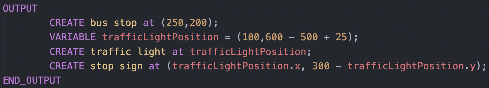

Creates the following map:


## CREATE Statements

Create statements are what actually puts things (markers, streets, buildings, etc.) onto the map. They can be used in [Function Declarations](#functions) or the [OUTPUT block](#output-block).

### Creating Markers

Creating markers can be done by specifying a marker type and a [Position](#positions-xy):

`CREATE <marker-type> at <position>;`

Where "marker type" may be one of:

- `bus stop`
- `traffic light`
- `stop sign`
- `train stop`

#### CREATE Marker Usage Examples:

This code:

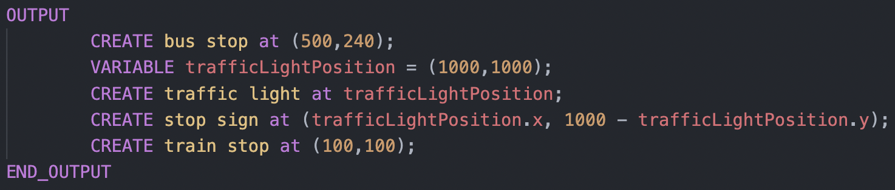

Creates the following map:

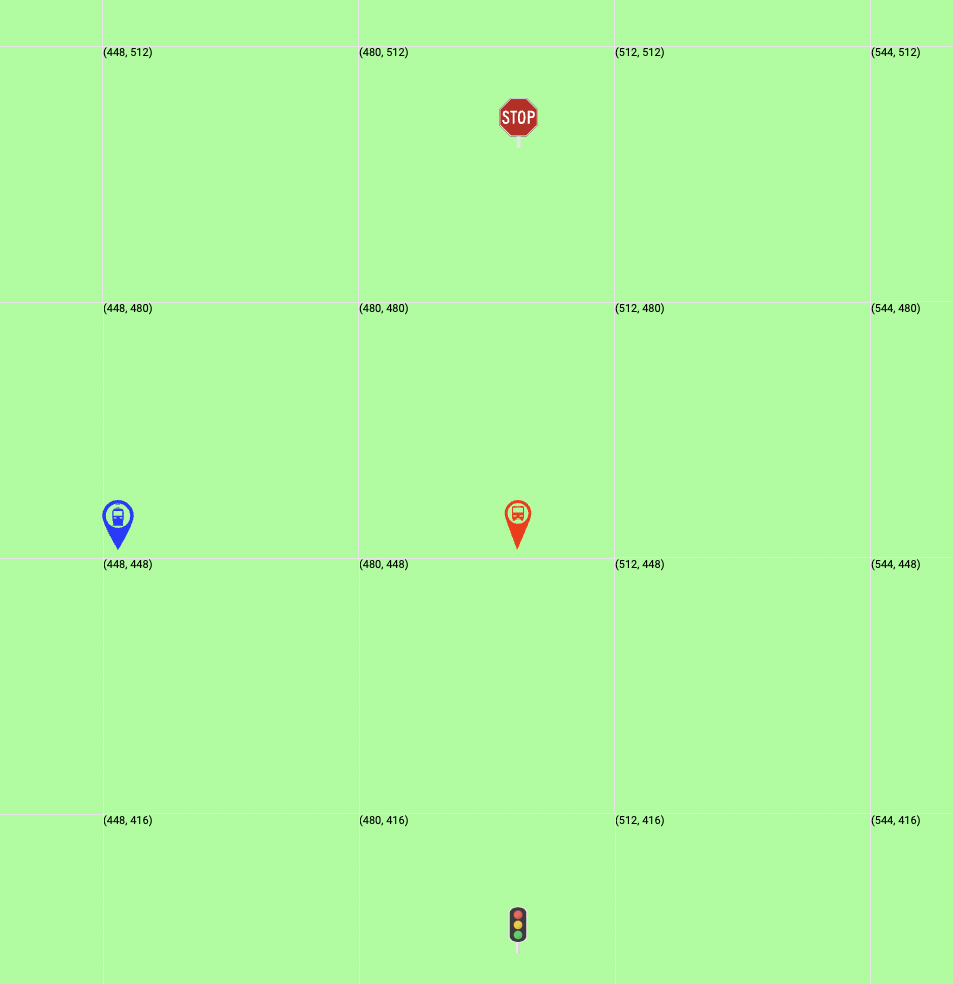

### Creating Streets, Highways, and Bridges

Creating streets can be done by specifying a street type as well as both the start and end [Positions](#positions-xy):

`CREATE <street-type> from <position-1> to <position-2>;`

Where "street type" may be one of:

- `street`
- `highway`
- `bridge`

#### CREATE Street Usage Examples:

This code:

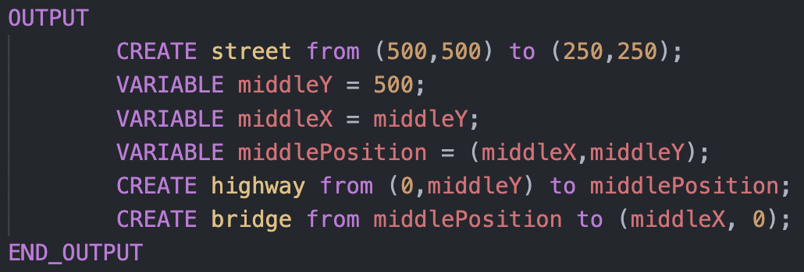

Creates the following map:

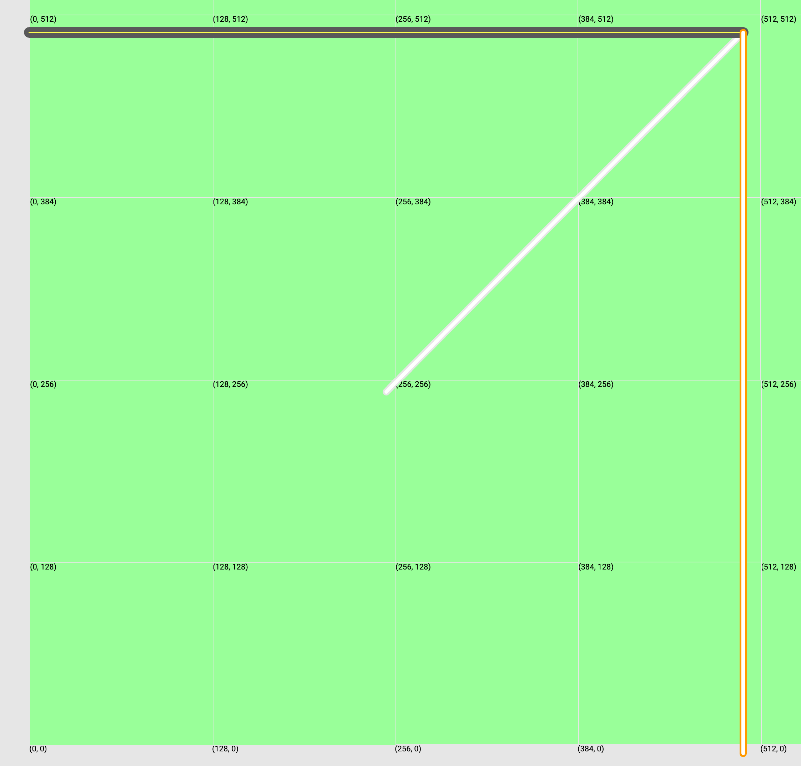

### Creating Buildings and Water

Creating buildings or water can be done by specifying a type and four coordinate [Positions](#positions-xy). The positions must be stated in rectangular order.

For example, this would start with the top left, go to top right, go to bottom right, then finish with bottom left:

`CREATE <polygon type> at NorthWestPosition NorthEastPosition SouthEastPosition SouthWestPosition;`

Another example, this would start with the bottom left, go to bottom right, go to top right, then finish with top left:

`CREATE <polygon type> at SouthWestPosition SouthEastPosition NorthEastPosition NorthWestPosition;`

Where "polygon type" may be one of:

- `building`
- `water`

#### CREATE Polygon Usage Examples:

Note: Code is unnecessarily verbose so that you can understand the documentation better.

This code:

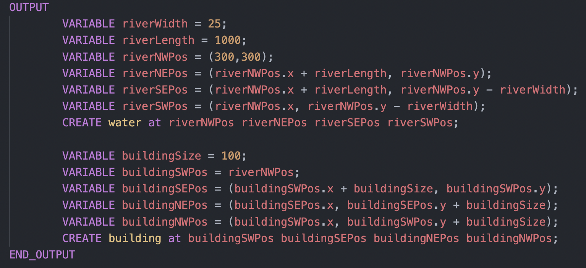

Creates the following map:

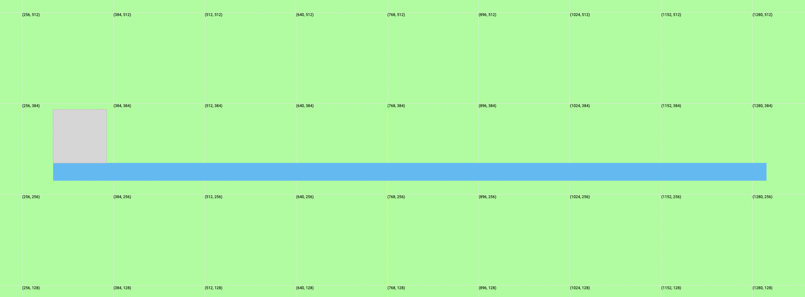

## Expressions

In this documentation, we will refer to expressions as anything that evaluates to a primitive value. For example, an expression could be a simple number (4 or 1212), a simple boolean (true or false), a [Position](#positions-xy), or any other computation that can be evaluated.

#### Expression Examples:

```
  // Boolean expression examples
  true
  12 > 5 AND 1 < 10 OR 1 < 2
  myBooleanVariable // where myBooleanVariable holds an expression that evaluates to a boolean

  // Number expressions examples
  10
  12 + 2
  myNumberVariable // where myNumberVariable holds an expression that evaluates to a number

  // Position expression examples
  (10,10);
  myPositionVariable // where myPositionVariable holds an expression that evaluates to a position
  (myNumberVariable1, myNumberVariable2) // where myNumberVariables evaluate to numbers
```

### Operator Precedence

Expressions follow the usual operator precedence. The following table summarizes the operator precedence, from highest precedence (most binding) to lowest precedence (least binding). Operators in the same box have the same precedence. Operators are all binary and evaluate from left to right.

| Operator                         | Description                                         |
| -------------------------------- | --------------------------------------------------- |
| `(expressions...)`               | Parenthesized expression                            |
| `*`, `/`                         | Numbers only: multiplication, division              |
| `+`, `-`                         | Numbers only: addition, subtraction                 |
| `>`, `<`, `>=`, `<=`, `==`, `!=` | Numbers only: comparisons                           |
| `==`, `!=`, `AND`, `OR`          | Booleans only: comparisons, logical AND, logical OR |

## Variables and Constants

Variables and constants are a way to store values that you want to refer to in many locations. Variables can be assigned to any [Expression](#expressions).

### Variable Declarations

You can declare a variable inside [Functions](#functions), or inside the [OUTPUT block](#output-block), and they can be used only after they have been declared. They can be reassigned any time after they are declared.

They can be declared by : `VARIABLE myVariableName = v` where `v` can be any expression.

#### VARIABLE Declaration Examples:

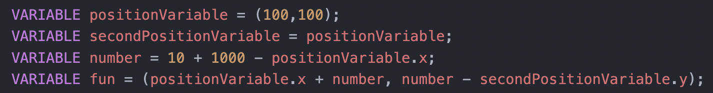

### Reassigning Variables

Variables can be reassigned at any point after they have been declared, to any expression, of any type.

#### Variable Reassignment Examples:

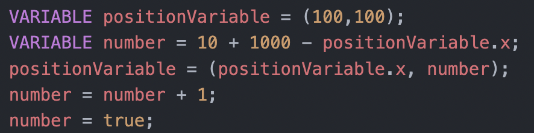

### Constant Declarations

You can declare a constant only inside the [DEFINITIONS block](#definitions-block), and they can be used anywhere in your program. They can not be reassigned.

They can be declared by : `CONSTANT myConstantName = v` where `v` can be any expression.

#### CONSTANT Declaration Examples:

This code:

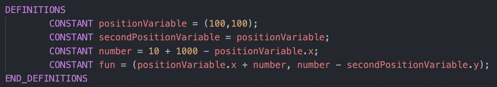

### Accessing X and Y Coordinates From Variables/Constants

[Constants and Variables](#variables-and-constants) can hold positions. Sometimes it can be useful to access the x or y position of the coordinate. You can do this simply by appending ".x" or ".y" to the name of the [Position](#positions-xy) variable you want to access the coordinate from.

`myPositionVariable.x` or `myPositionVariable.y`

#### Coordinate Access Examples:

This code:

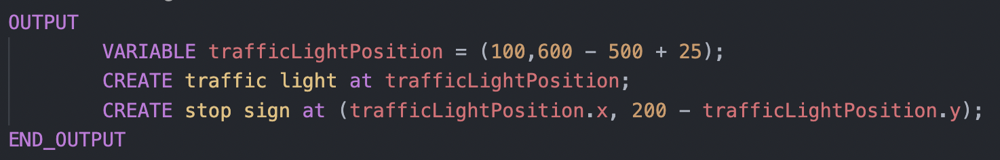

Creates the following map:

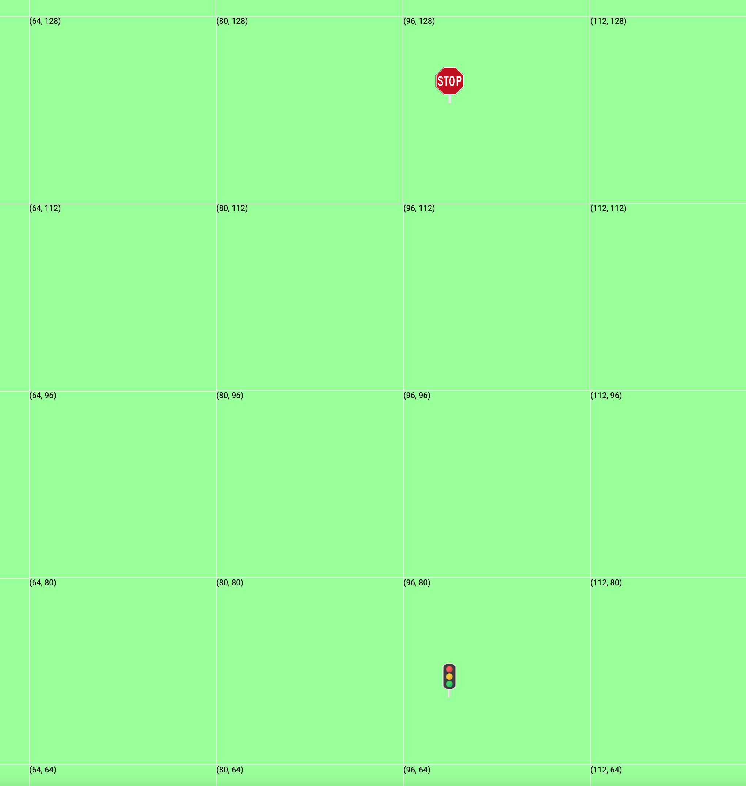

## Functions

### Function Declarations

You can declare a function only inside the [DEFINITIONS block](#definitions-block). Declaring and using functions allow for, most commonly, the quick creation of certain map patterns throughout different locations in the map. Functions do not return a value; instead, they are simply another way of creating things on the map with [CREATE statements](#create-statements). Functions can take in any number of inputs (ie. parameters/arguments), each separated by a comma. Functions can then declare [variables](#variable-declarations), reassign variables, use [loops](#loops), call other functions, and create anything with [CREATE statements](#create-statements).

#### FUNCTION Declaration Examples:

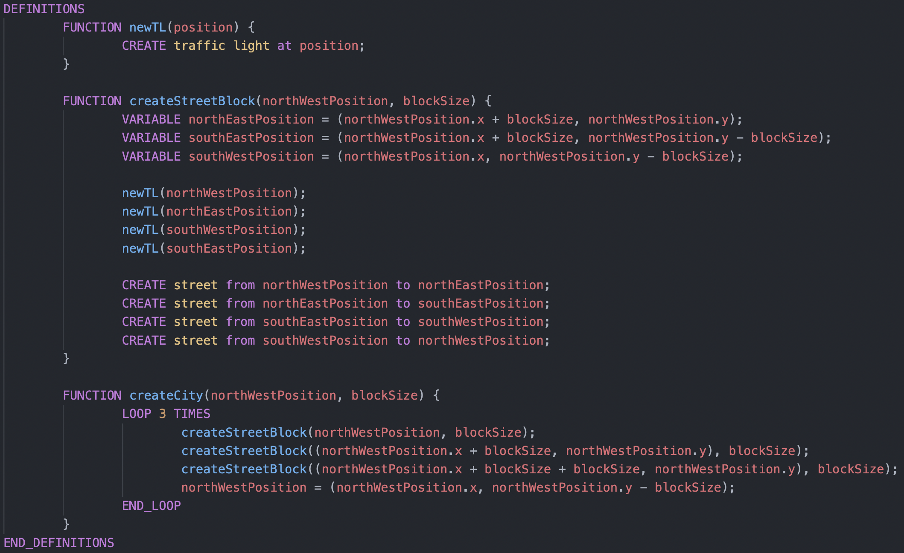

### Function Calls

Function calls can be made either within other functions, or within the [OUTPUT block](#output-block).

#### Function Call Examples:

This code (with the function declarations above):

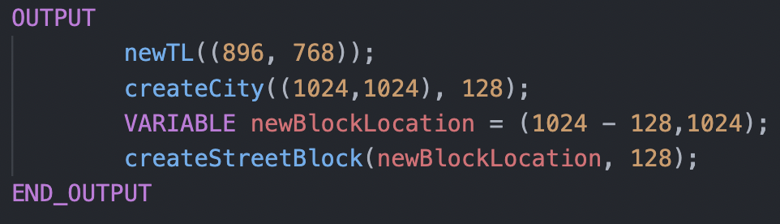

Creates the following map:


## Control Flow

### Loops

You can use loops inside [FUNCTION declarations](#functions), or in the [OUTPUT block](#output-block). Loops can be used to execute any number of statements any number of times. You must specify the number of times to loop through any expression that evaluates to a number.

#### LOOP Example 1:

This code:

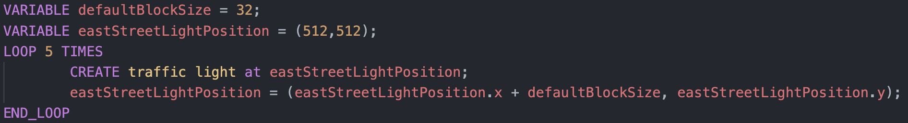

Creates the following map:

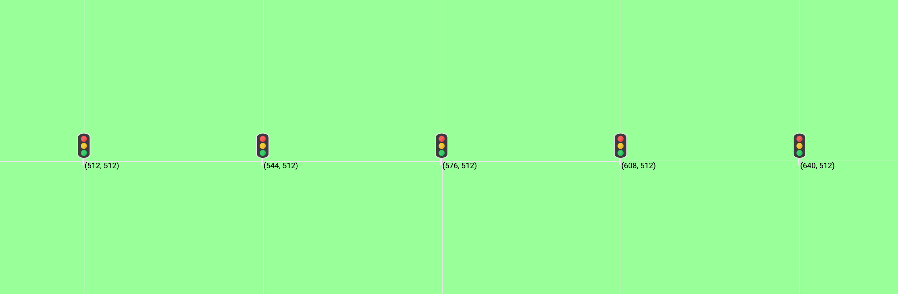

#### LOOP Example 2:

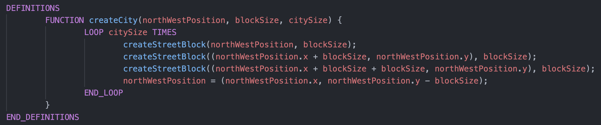

### IF / ELSE_IF / ELSE

You can use loops inside [FUNCTION declarations](#functions), or in the [OUTPUT block](#output-block). You can use IF blocks to conditionally preform operations in your program. IF blocks can contain ELSE_IF, as well as ELSE blocks. IF blocks can also be nested.

#### IF / ELSE_IF / ELSE General Usage Examples:

```
IF 1 > 2 THEN
        // do something
ELSE
        // do something else
END_IF

IF myBooleanVariable THEN
        // do something
ELSE_IF myFirstNumberVariable > mySecondNumberVariable THEN
        // do something else if
END_IF
```

#### IF / ELSE_IF / ELSE Examples:

This code:

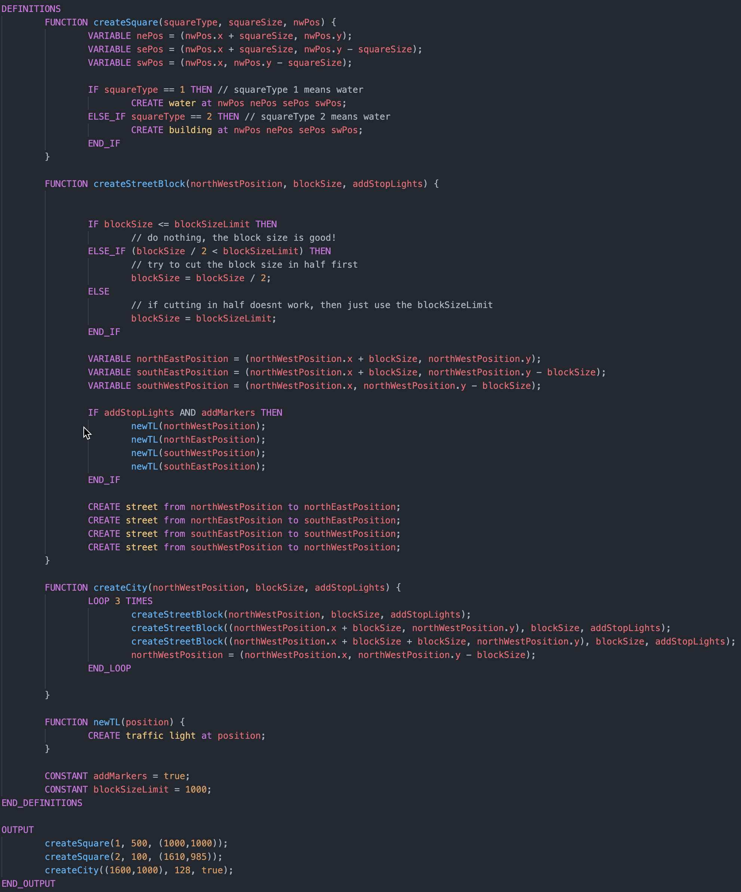

Creates the following map:

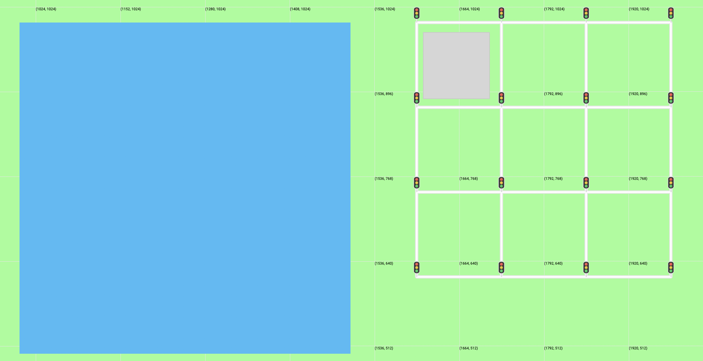

## Program Structure

### OUTPUT Block

Defining a OUTPUT block is required. Output blocks contain all the statements that are meant specifically to build the map. The output block can contain [CREATE statements](#create-statements), [VARIABLE declarations](#variable-declarations), [variable assignments](#reassigning-variables), [function calls](#function-calls), and [LOOPs](#loops).

#### OUTPUT Block Example:

This code:

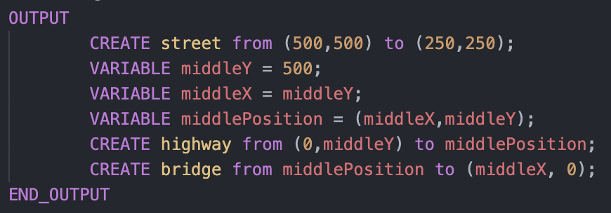

Creates the following map:


### DEFINITIONS Block

Defining a DEFINITIONS block is optional. If you define a DEFINITIONS block, it must be above the OUTPUT block. The DEFINITIONS block contains all the [CONSTANT](#constant-declarations), and [FUNCTION](#functions) declarations.

#### DEFINITIONS Block Example:

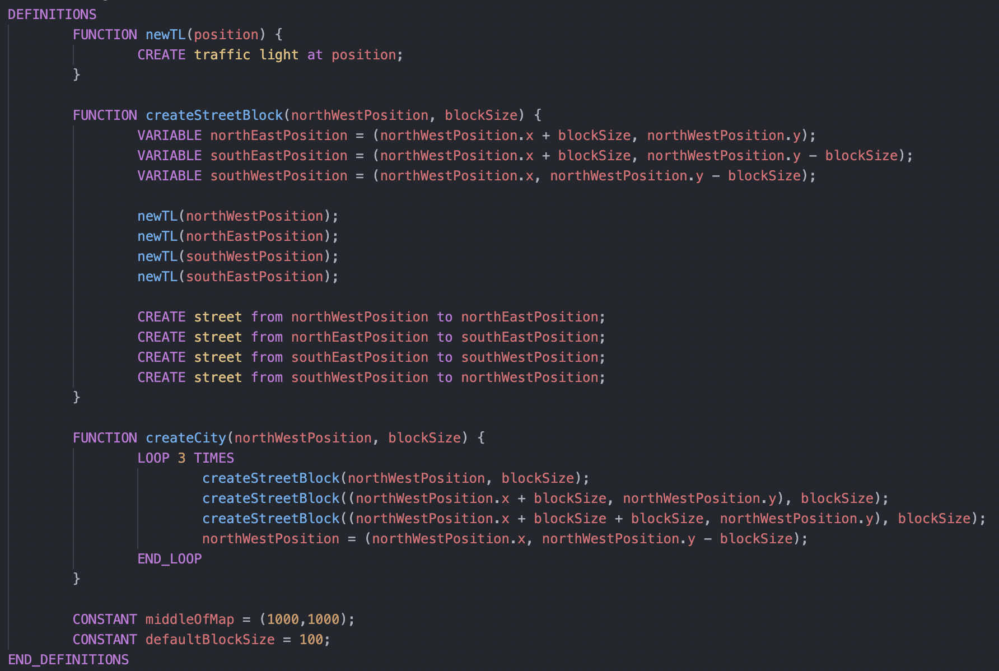

### Defining a Canvas Size

Defining a canvas size is optional. You can define the canvas size of your map by including `CANVAS_SIZE = width by height;` at the top of your file, where width and height are both positive numbers no larger than 100000 and no less than 500.

You'll notice when rendering the map that the canvas size you specified will then be rounded up to to a certain multiple of 256 - this is intentional, and you do not need to worry about it. You may still only use coordinates in your specified canvas size. For example, if you specify a canvas size of 3000 by 3000, you may only render items within 3000 by 3000. But you'll notice the rendered map will be of size 4096 by 4096.

If you do not define a canvas size, the default is 8192 by 4096 - meaning that your x coordinate can go up to 8192, and your y coordinate can go up to 4096.

#### Canvas Size Example:

```
CANVAS_SIZE = 1000 by 1000;
```

Would result in a rendered canvas size of 1024 by 1024.

## Other Features / Things to Know

### Comments

You can put a line comment anywhere in your program using the syntax: `// this is a line comment`.

#### Comment Example:

```
VARIABLE cityCentreLocation = (100,100); // stores the location of the city centre
```

### Calling Functions Within Functions and Recursion

You have full power to call functions within other functions, or do any type of recursion if necessary. An error will appear if you accidentally have infinite recursion in your code.

#### Recursion vs Loop Example:

This code:

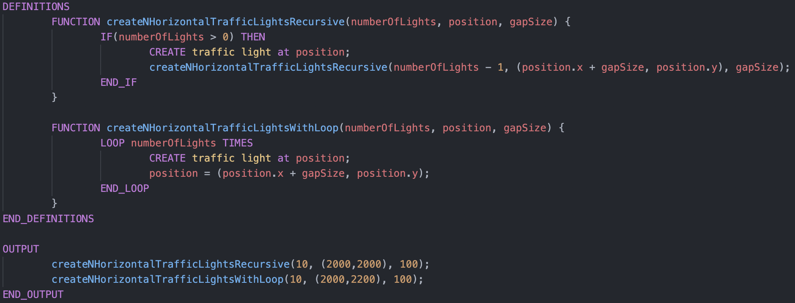

Creates the following map:

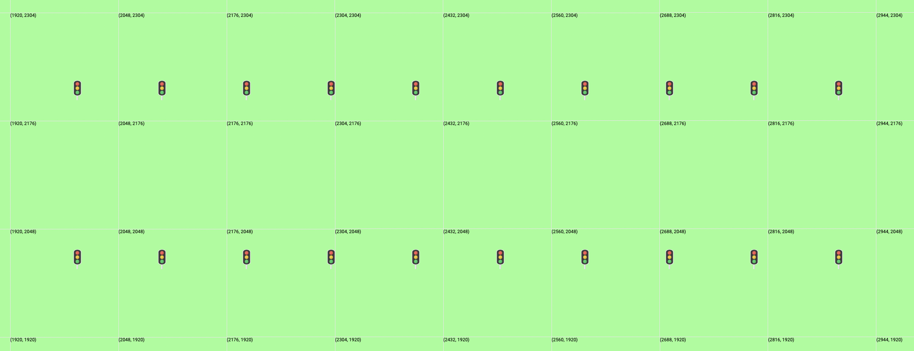

### Reserved Keywords and Variable Name Restrictions

Note that variable, constant, or function names must start with a character, and optionally can be followed by a character or a number (1 char minimum). They also cannot be named the same as any keyword listed in this documentation used in commands and structuring (including `FUNCTION`, `VARIABLE`, `CONSTANT`, `LOOP`, `street`, etc.).

### Errors:

Errors will display as red underlines in your .mg file when you have the editor open. If there are errors in your program, the map will likely still render as much as possible. However, the output will be inaccurate until you fix the errors.

### Known Bugs:

1. Sometimes the VS Code editor may stop working as expected. You may notice syntax highlighting stops working, errors are not showing properly, and the map will not load. This is due to an infinite loop or similar bug that seems to be happening within the ANTLR parser, presumably due to the definition of our grammar rules. If this happens, please restart the editor.

## Entire Program

To sum things up: here is a list of everything that is allowed in each section of the program.

- CANVAS_SIZE (optional)
- DEFINITIONS block (optional)
  - FUNCTION declarations
    - Variable Declarations
    - Loops
      - Variable Declarations
      - If/elseif/else
      - Create statements
      - Variable reassignments
      - Loops
    - If/elseif/else
      - Variable Declarations
      - If/elseif/else
      - Create statements
      - Variable reassignments
      - Loops
    - Create statements
    - Variable reassignments
  - CONSTANT declarations
- OUTPUT block
  - Function calls
  - Create statements
  - Loops
    - Variable Declarations
    - If/elseif/else
    - Create statements
    - Variable reassignments
    - Loops
  - If/elseif/else
    - Variable Declarations
    - If/elseif/else
    - Create statements
    - Variable reassignments
    - Loops
  - Variable declarations
  - Variable reassignments

#### Program Example:

TO BE IMPLEMENTED
