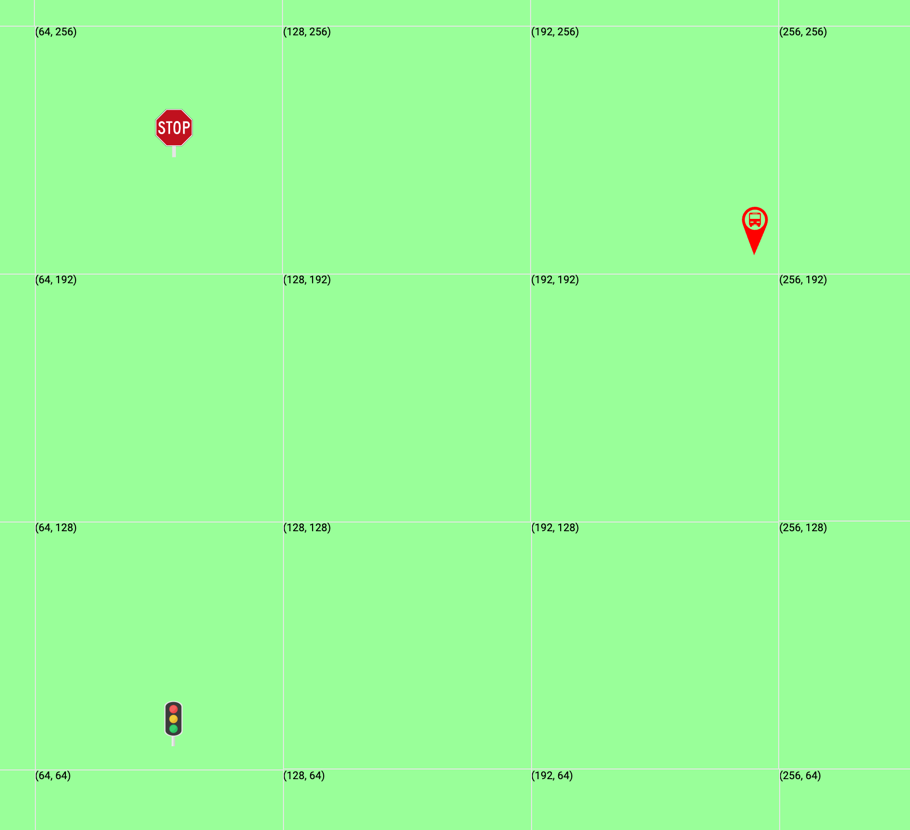
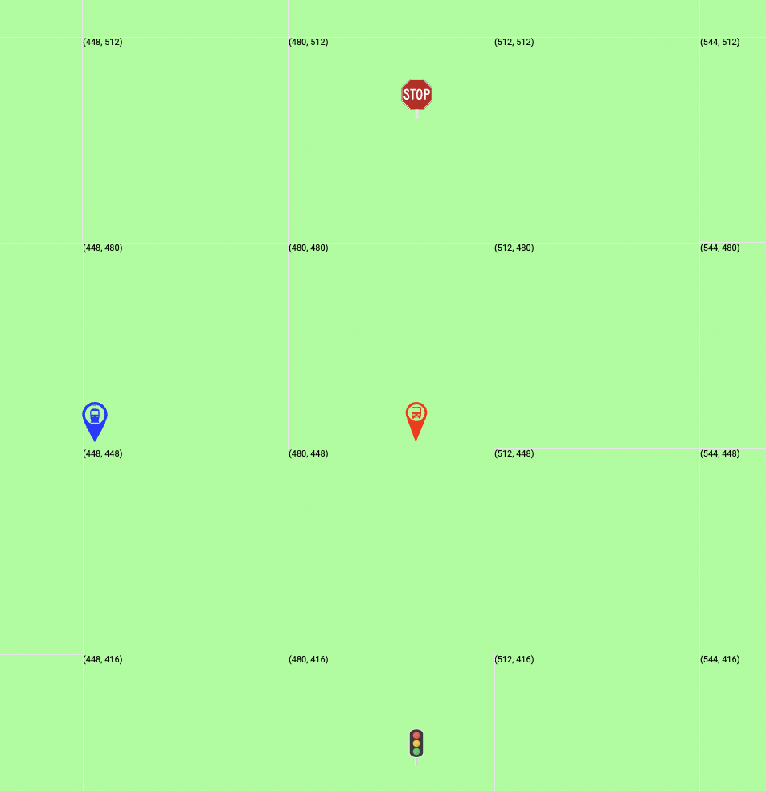
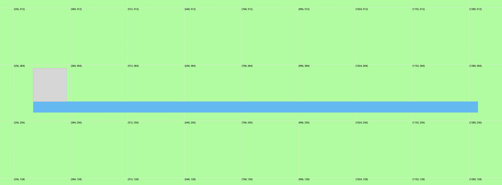
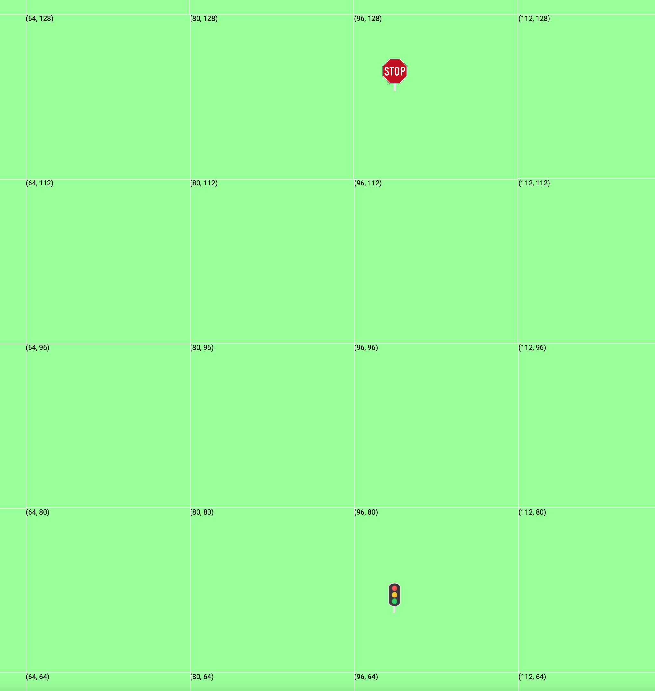
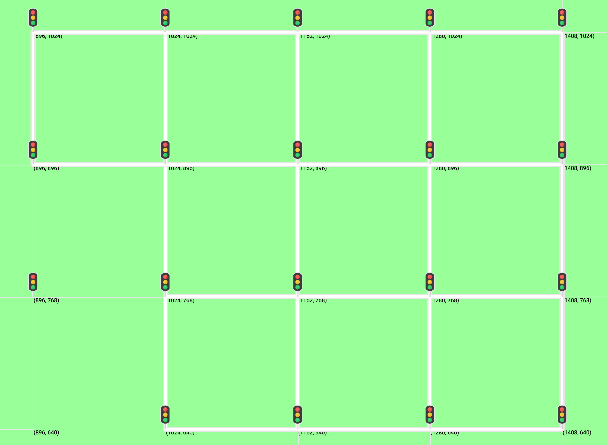
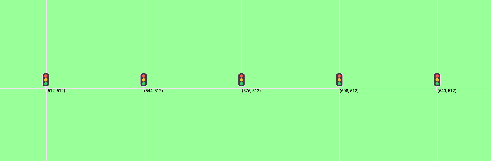
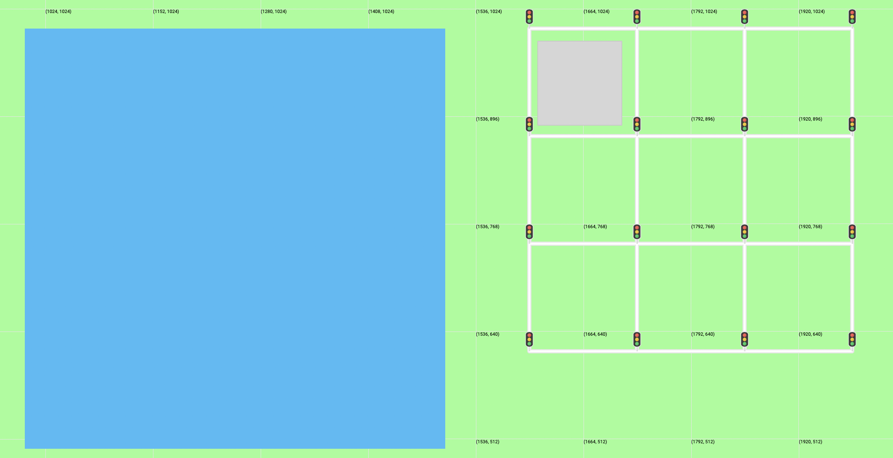

# Map Generator Language (.mg) Documentation

## The Basics

### Positions (x,y)

Positions are in the format `(x, y)`, where x and y are any two expressions that evaluate to integers.

#### Position Usage examples:

```
CREATE bus stop at (250,200);
VARIABLE trafficLightPosition = (100,600 - 500 + 25);
CREATE traffic light at trafficLightPosition;
CREATE stop sign at (trafficLightPosition.x, 300 - trafficLightPosition.y);
```

Creates the following map:


### Creating markers

Creating markers can be done by specifying a marker type, and a location like: `CREATE [bus stop, traffic light, stop sign, or train stop] at (x,y);`

#### CREATE (Marker) Usage examples:

```
CREATE bus stop at (500,240);
VARIABLE trafficLightPosition = (1000,1000);
CREATE traffic light at trafficLightPosition;
CREATE stop sign at (trafficLightPosition.x, 1000 - trafficLightPosition.y);
CREATE train stop at (100,100);
```

Creates the following map:


### Creating Streets, Highways, and Bridges

Creating streets can be done by specifying a street type, a start location, and an end location: `CREATE [street, highway, or bridge] from (x1,y1) to (x2,y2);`

#### CREATE (Line) Usage examples:

```
CREATE street from (500,500) to (250,250);
VARIABLE middleY = 500;
VARIABLE middleX = middleY;
VARIABLE middlePosition = (middleX,middleY);
CREATE highway from (0,middleY) to middlePosition;
CREATE bridge from middlePosition to (middleX, 0);
```

Creates the following map:


### Creating Buildings and Water

Creating buildings or water can be done by specifying four coordinate positions, in any logical order that creates a rectangle: `CREATE [water or building] at pos1 pos2 pos3 pos4;`

You can think of it like this: `CREATE [water or building] at NorthWestPosition NorthEastPosition SouthEastPosition SouthWestPosition;`
Or this: `CREATE [water or building] at SouthWestPosition SouthEastPosition NorthEastPosition NorthWestPosition;`

#### CREATE (Polygon) Usage examples:

Note: Code is unnecessary verbose so that you can understand the documentation better

```
VARIABLE riverWidth = 25;
VARIABLE riverLength = 1000;
VARIABLE riverNWPos = (300,300);
VARIABLE riverNEPos = (riverNWPos.x + riverLength, riverNWPos.y);
VARIABLE riverSEPos = (riverNWPos.x + riverLength, riverNWPos.y - riverWidth);
VARIABLE riverSWPos = (riverNWPos.x, riverNWPos.y - riverWidth);
CREATE water at riverNWPos riverNEPos riverSEPos riverSWPos;

VARIABLE buildingSize = 100;
VARIABLE buildingSWPos = riverNWPos;
VARIABLE buildingSEPos = (buildingSWPos.x + buildingSize, buildingSWPos.y);
VARIABLE buildingNEPos = (buildingSEPos.x, buildingSEPos.y + buildingSize);
VARIABLE buildingNWPos = (buildingSWPos.x, buildingSWPos.y + buildingSize);
CREATE building at buildingSWPos buildingSEPos buildingNEPos buildingNWPos;
```

Creates the following map:


## Variables and Constants

### Variable Declarations

Variables are a place to store data that you want to refer to in many locations. You can declare a variable inside functions, or inside the [OUTPUT block](#reassigning-variables), and they can be used only after they have been declared. They can be declared by : `VARIABLE myVariableName = v` where `v` can be another variable name, a position, or any other value that evaluates to an integer.

#### VARIABLE Declaration examples:

```
VARIABLE positionVariable = (100,100);
VARIABLE secondPositionVariable = positionVariable;
VARIABLE number = 10 + 1000 - positionVariable.x;
VARIABLE fun = (positionVariable.x + number, number - secondPositionVariable.y);
```

### Reassigning Variables

Variables can be reassigned at any point after they have been declared.

Variable Reassignment example:

```
VARIABLE positionVariable = (100,100);
VARIABLE number = 10 + 1000 - positionVariable.x;
positionVariable = (positionVariable.x, number);
```

### Constant Declarations

Constants are a place to store data that you want to refer to in many locations, anywhere in the program. You can declare a constant only inside the [DEFINITIONS block](#reassigning-variables), and it can be used anywhere in the program. They can be declared by : `CONSTANT myConstantName = v` where `v` can be another variable name, a position, or any other value that evaluates to an integer. Constants can not be reassigned after they are declared.

#### CONSTANT Declaration examples:

```
CONSTANT positionVariable = (100,100);
CONSTANT secondPositionVariable = positionVariable;
CONSTANT number = 10 + 1000 - positionVariable.x;
CONSTANT fun = (positionVariable.x + number, number - secondPositionVariable.y);
```

### Accessing X and Y Coordinates From Variables/Constants

Constants and variables can hold positions. Sometimes it can be useful to access the x or y position of the coordinate.

#### Coordinate Access Examples:

```
VARIABLE trafficLightPosition = (100,600 - 500 + 25);
CREATE traffic light at trafficLightPosition;
CREATE stop sign at (trafficLightPosition.x, 200 - trafficLightPosition.y);
```

Creates the following map:


## Functions

### Function Declarations

Declaring functions allow for the quick creation of certain street or marker patterns throughout different locations in the map. Functions do not return a value; instead, they are simply another way of creating things on the map. Functions can take in any number of inputs (ie. parameters/arguments), each separated by a comma. Functions can then declare variables, use loops, call other functions, and create any number of streets or markers.

#### FUNCTION Declaration examples:

```
FUNCTION newTL(position) {
        CREATE traffic light at position;
}

FUNCTION createStreetBlock(northWestPosition, blockSize) {
        VARIABLE northEastPosition = (northWestPosition.x + blockSize, northWestPosition.y);
        VARIABLE southEastPosition = (northWestPosition.x + blockSize, northWestPosition.y - blockSize);
        VARIABLE southWestPosition = (northWestPosition.x, northWestPosition.y - blockSize);

        newTL(northWestPosition);
        newTL(northEastPosition);
        newTL(southWestPosition);
        newTL(southEastPosition);

        CREATE street from northWestPosition to northEastPosition;
        CREATE street from northEastPosition to southEastPosition;
        CREATE street from southEastPosition to southWestPosition;
        CREATE street from southWestPosition to northWestPosition;
}

FUNCTION createCity(northWestPosition, blockSize) {
        LOOP 3 TIMES
                createStreetBlock(northWestPosition, blockSize);
                createStreetBlock((northWestPosition.x + blockSize, northWestPosition.y), blockSize);
                createStreetBlock((northWestPosition.x + blockSize + blockSize, northWestPosition.y), blockSize);
                northWestPosition = (northWestPosition.x, northWestPosition.y - blockSize);
        END_LOOP
}
```

### Function Calls

Function calls can be made either within other functions, or within the [OUTPUT block](#reassigning-variables).

#### Function call examples:

```
newTL((896, 768));
createCity((1024,1024), 128);
VARIABLE newBlockLocation = (1024 - 128,1024);
createStreetBlock(newBlockLocation, 128);
```

Creates the following map:


## Control Flow

### Loops

Loops can be used to execute any number of statements any number of times. You must specify the number of times to loop.

#### LOOP example usage 1:

```
VARIABLE defaultBlockSize = 32;
VARIABLE eastStreetLightPosition = (512,512);
LOOP 5 TIMES
	CREATE traffic light at eastStreetLightPosition;
	eastStreetLightPosition = (eastStreetLightPosition.x + defaultBlockSize, eastStreetLightPosition.y);
END_LOOP
```

Creates the following map:


#### LOOP example usage 2:

```
FUNCTION createCity(northWestPosition, blockSize) {
        LOOP 3 TIMES
                createStreetBlock(northWestPosition, blockSize);
                createStreetBlock((northWestPosition.x + blockSize, northWestPosition.y), blockSize);
                createStreetBlock((northWestPosition.x + blockSize + blockSize, northWestPosition.y), blockSize);
                northWestPosition = (northWestPosition.x, northWestPosition.y - blockSize);
        END_LOOP
}
```

### IF / ELSE_IF / ELSE

You can use IF blocks to conditionally preform operations in your program. IF blocks can contain ELSE_IF, as well as ELSE blocks. IF blocks can also be nested.

#### IF / ELSE_IF / ELSE example usage 1:

```
IF 1 > 2 THEN
        // do something
ELSE
        // do something else
END_IF

IF myBooleanVariable THEN
        // do something
ELSE_IF myFirstNumberVariable > mySecondNumberVariable THEN
        // do something else if
END_IF
```

#### IF / ELSE_IF / ELSE example usage 2:

```
DEFINITIONS
        FUNCTION createSquare(squareType, squareSize, nwPos) {
                VARIABLE nePos = (nwPos.x + squareSize, nwPos.y);
                VARIABLE sePos = (nwPos.x + squareSize, nwPos.y - squareSize);
                VARIABLE swPos = (nwPos.x, nwPos.y - squareSize);

                IF squareType == 1 THEN // squareType 1 means water
                        CREATE water at nwPos nePos sePos swPos;
                ELSE_IF squareType == 2 THEN // squareType 2 means water
                        CREATE building at nwPos nePos sePos swPos;
                END_IF
        }

        FUNCTION createStreetBlock(northWestPosition, blockSize, addStopLights) {


                IF blockSize <= blockSizeLimit THEN
                        // do nothing, the block size is good!
                ELSE_IF (blockSize / 2 < blockSizeLimit) THEN
                        // try to cut the block size in half first
                        blockSize = blockSize / 2;
                ELSE
                        // if cutting in half doesnt work, then just use the blockSizeLimit
                        blockSize = blockSizeLimit;
                END_IF

                VARIABLE northEastPosition = (northWestPosition.x + blockSize, northWestPosition.y);
                VARIABLE southEastPosition = (northWestPosition.x + blockSize, northWestPosition.y - blockSize);
                VARIABLE southWestPosition = (northWestPosition.x, northWestPosition.y - blockSize);

                IF addStopLights AND addMarkers THEN
                        newTL(northWestPosition);
                        newTL(northEastPosition);
                        newTL(southWestPosition);
                        newTL(southEastPosition);
                END_IF

                CREATE street from northWestPosition to northEastPosition;
                CREATE street from northEastPosition to southEastPosition;
                CREATE street from southEastPosition to southWestPosition;
                CREATE street from southWestPosition to northWestPosition;
        }

        FUNCTION createCity(northWestPosition, blockSize, addStopLights) {
                LOOP 3 TIMES
                        createStreetBlock(northWestPosition, blockSize, addStopLights);
                        createStreetBlock((northWestPosition.x + blockSize, northWestPosition.y), blockSize, addStopLights);
                        createStreetBlock((northWestPosition.x + blockSize + blockSize, northWestPosition.y), blockSize, addStopLights);
                        northWestPosition = (northWestPosition.x, northWestPosition.y - blockSize);
                END_LOOP

        }

        FUNCTION newTL(position) {
                CREATE traffic light at position;
        }

        CONSTANT addMarkers = true;
        CONSTANT blockSizeLimit = 1000;
END_DEFINITIONS

OUTPUT
        createSquare(1, 500, (1000,1000));
        createSquare(2, 100, (1610,985));
        createCity((1600,1000), 128, true);
END_OUTPUT
```

Creates the following map:


## Program Structure

### OUTPUT Block

These are required. Output blocks contain all of the statements that are meant specifically to build the map. The output block can contain variable declarations, variable reassignments, function calls, and loops.

#### OUTPUT Block Example:

```
OUTPUT
        CREATE street from (500,500) to (250,250);
        VARIABLE middleY = 500;
        VARIABLE middleX = middleY;
        VARIABLE middlePosition = (middleX,middleY);
        CREATE highway from (0,middleY) to middlePosition;
        CREATE bridge from middlePosition to (middleX, 0);
END_OUTPUT
```

Creates the following map:


### DEFINITIONS Block

These are optional. If you define a DEFINITIONS block, it must be above the OUTPUT block. Definition blocks contain all of the constant and function declarations.

#### DEFINITIONS Block Example:

```
DEFINITIONS
        FUNCTION newTL(position) {
                CREATE traffic light at position;
        }

        FUNCTION createStreetBlock(northWestPosition, blockSize) {
                VARIABLE northEastPosition = (northWestPosition.x + blockSize, northWestPosition.y);
                VARIABLE southEastPosition = (northWestPosition.x + blockSize, northWestPosition.y - blockSize);
                VARIABLE southWestPosition = (northWestPosition.x, northWestPosition.y - blockSize);

                newTL(northWestPosition);
                newTL(northEastPosition);
                newTL(southWestPosition);
                newTL(southEastPosition);

                CREATE street from northWestPosition to northEastPosition;
                CREATE street from northEastPosition to southEastPosition;
                CREATE street from southEastPosition to southWestPosition;
                CREATE street from southWestPosition to northWestPosition;
        }

        FUNCTION createCity(northWestPosition, blockSize) {
                LOOP 3 TIMES
                        createStreetBlock(northWestPosition, blockSize);
                        createStreetBlock((northWestPosition.x + blockSize, northWestPosition.y), blockSize);
                        createStreetBlock((northWestPosition.x + blockSize + blockSize, northWestPosition.y), blockSize);
                        northWestPosition = (northWestPosition.x, northWestPosition.y - blockSize);
                END_LOOP
        }

        CONSTANT centerPosition = (512,512);
        CONSTANT defaultBlockSize = 256;
END_DEFINITIONS
```

### DEFINITIONS Block

These are optional. If you define a DEFINITIONS block, it must be above the OUTPUT block. Definition blocks contain all of the constant and function declarations.

## Entire Program

To sum things up: here is a list of everything that is allowed in each section of the program.

- DEFINITIONS block
  - FUNCTION declarations
    - Variable Declarations
    - Loops
    - Create statements
    - Variable reassignments
  - CONSTANT declarations
- OUTPUT block
  - Function calls
  - Create statements
  - Loops
  - Variable declarations
  - Variable reassignments

#### Program example:

```
DEFINITIONS
        FUNCTION createStreetBlock(northWestPosition, blockSize) {
                VARIABLE northEastPosition = (northWestPosition.x + blockSize, northWestPosition.y);
                VARIABLE southEastPosition = (northWestPosition.x + blockSize, northWestPosition.y - blockSize);
                VARIABLE southWestPosition = (northWestPosition.x, northWestPosition.y - blockSize);

                CREATE traffic light at northWestPosition;
                CREATE traffic light at northEastPosition;
                CREATE traffic light at southWestPosition;
                CREATE traffic light at southEastPosition;

                CREATE street from northWestPosition to northEastPosition;
                CREATE street from northEastPosition to southEastPosition;
                CREATE street from southEastPosition to southWestPosition;
                CREATE street from southWestPosition to northWestPosition;
        }

        FUNCTION createTrafficLight(position) {
                CREATE traffic light at position;
        }

        FUNCTION createCity(northWestPosition, blockSize) {
                LOOP 3 TIMES
                        createStreetBlock(northWestPosition, blockSize);
                        createStreetBlock((northWestPosition.x + blockSize, northWestPosition.y), blockSize);
                        createStreetBlock((northWestPosition.x + blockSize + blockSize, northWestPosition.y), blockSize);
                        northWestPosition = (northWestPosition.x, northWestPosition.y - blockSize);
                END_LOOP
        }

        CONSTANT centerPosition = (512,512);
        CONSTANT defaultBlockSize = 256;
END_DEFINITIONS

OUTPUT
        createStreetBlock(centerPosition, defaultBlockSize);
        createStreetBlock((centerPosition.x + defaultBlockSize, centerPosition.y), defaultBlockSize);

        createCity((1024,1024), 124);
        CREATE highway from (0,centerPosition.y) to centerPosition;
        CREATE bridge from (0,0) to centerPosition;

        createTrafficLight(centerPosition);
        CREATE stop sign at (512, 256);
        CREATE bus stop at (768, 384);
        CREATE train stop at (1024, 384);

        VARIABLE loops= 10;

        VARIABLE eastStreetLightPosition = (centerPosition.x, centerPosition.y);

        LOOP 10 TIMES
            createTrafficLight(eastStreetLightPosition);
            eastStreetLightPosition = (eastStreetLightPosition.x + defaultBlockSize, eastStreetLightPosition.y);
        END_LOOP

        CREATE street from (0,0) to (256,100);
        VARIABLE middleY = 1024;
        VARIABLE middleX = middleY;
        VARIABLE middlePosition = (middleX,middleY);
        CREATE highway from (0,middleY) to middlePosition;
        CREATE bridge from middlePosition to (2048, 0);
        CREATE bus stop at (500,240);
        VARIABLE trafficLightPosition = (1000,1000);
        CREATE traffic light at trafficLightPosition;
        CREATE stop sign at (trafficLightPosition.x, 1000 - trafficLightPosition.y);
        CREATE train stop at (100,100);
        VARIABLE positionVariable = (100,100);
        VARIABLE secondPositionVariable = positionVariable;
        VARIABLE number = 10 + 1000 - positionVariable.x;
        VARIABLE fun = (positionVariable.x + number, number - secondPositionVariable.y);
END_OUTPUT

```
